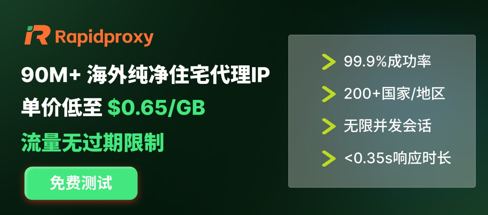

<p><strong style="color:red;">⚠ 🚨 [DEPRECATED] V1 is no longer maintained due to API changes. <p>🔥 V2 (Working & Undetected) is currently closed-source and exclusively available in our community. <p>👉 Join our TG/Discord (HNUDAO Dev) to get API access: <a href="https://t.me/+inDiCrZ6ZeZiODQx">https://t.me/+inDiCrZ6ZeZiODQx</a></strong></p>

# codex_auto_register

[English](README_EN.md) | 简体中文

这是一款基于 DuckMail API 的自动化 OAuth 授权测试工具，旨在研究 AI 接口的高并发调用与身份验证机制。本工具由 [HNU 区块链协会](https://github.com/HNUDAO) 维护开发。

For updates, bug reports, and more Web3/AI tools, join our official developer community: [Telegram 社群](https://t.me/+inDiCrZ6ZeZiODQx)

<div style="text-align: left;">
  <a href="https://bestproxy.com/?keyword=myspaqek" target="_blank">
    
  </a>
</div>

> [BestProxy](https://bestproxy.com/?keyword=myspaqek) — 高纯度住宅IP资源，支持一号一IP独享模式，全链路防关联，降低风控概率，显著提升账号通过率与长期存活率

<div style="text-align: left;">
  <a href="https://www.rapidproxy.io/?ref=Ttungx" target="_blank">
    
  </a>
</div>

> [RapidProxy](https://www.rapidproxy.io/?ref=Ttungx) — 高稳定住宅代理，动态轮换与静态独享IP，真实住宅IP资源，有效降低风控

---

## 赞助 HNU 区块链协会

| 档位 | 价格 | 权益 |
| --- | --- | --- |
| 银牌赞助 | 100U/月 | README底部logo + 协会官网展示 |
| 金牌赞助 | 300U/月 | README中部显眼位置 + 协会官网导师位 |
| 钻石赞助 | 500U/月 | README顶部独占 + 协会公众号推文 + GitHub讨论区置顶 |

>⚠️ **免责声明**：本项目仅供学习和研究使用，不得用于任何商业用途。使用本项目所产生的一切后果由使用者自行承担。

## 致谢

本项目基于原项目 https://github.com/adminlove520/chatgpt_register 改造而来。

当前仓库的主要差异：

- 将注册codex邮箱服务从原先方案替换为 DuckMail API
- 保留并扩展 Codex 协议 OAuth 流程
- 输出 CLIProxyAPI v6 可识别的 Codex auth files

## 包含内容

- `chatgpt_register.py`：根目录下的 DuckMail 注册脚本
- `codex/protocol_keygen.py`：纯 HTTP 的 Codex OAuth 注册与 token 生成脚本
- `duckmaildoc.md`：DuckMail API 参考文档(https://raw.githubusercontent.com/MoonWeSif/DuckMail/main/public/llm-api-docs.txt)
- [management.html](https://github.com/router-for-me/Cli-Proxy-API-Management-Center/releases)(自动更新)

## 环境依赖

根目录脚本：

```bash
pip install curl_cffi
```

Codex 脚本：

```bash
pip install requests urllib3
```

## 配置方式

仓库只提交示例配置，不提交真实配置。

使用前复制：

```bash
copy config.example.json config.json
copy codex\config.example.json codex\config.json
```

然后把你自己的 DuckMail、代理和 CPA 参数填进去。

## 根目录脚本

运行：

```bash
python chatgpt_register.py
```

对应示例配置见 `config.example.json`。

主要配置项：

| 配置项            | 说明                     |
| ----------------- | ------------------------ |
| total_accounts    | 注册账号数量             |
| duckmail_api_base | DuckMail API 地址        |
| duckmail_bearer   | DuckMail Bearer Token    |
| proxy             | HTTP/HTTPS 代理          |
| output_file       | 注册结果输出文件         |
| enable_oauth      | 是否执行 OAuth           |
| oauth_required    | 是否要求 OAuth 成功      |
| upload_api_url    | 可选，上传到 CPA 的接口  |
| upload_api_token  | 可选，CPA 管理接口 Token |

## Codex 协议脚本

运行：

```bash
python codex\protocol_keygen.py
```

对应示例配置见 `codex/config.example.json`。

该脚本会：

- 使用 DuckMail 创建临时邮箱
- 完成 ChatGPT 注册流程
- 执行 Codex OAuth 登录并换取 token
- 生成 CLIProxyAPI v6 兼容文件名的 token JSON
- 可选上传到 CPA 管理接口

## 输出说明

运行过程中通常会生成以下本地文件，这些都已加入 `.gitignore`，不会进入新仓库：

- `config.json`
- `codex/config.json`
- `registered_accounts.txt`
- `codex/accounts.txt`
- `codex/ak.txt`
- `codex/rk.txt`
- `codex/registered_accounts.csv`
- `codex/codex_tokens/`
- `codex/codex_accounts_tokens/`

## 仓库结构

```text
chatgpt_register/
├── chatgpt_register.py
├── config.example.json
├── duckmaildoc.md
├── README.md
└── codex/
    ├── config.example.json
    ├── protocol_keygen.py
    └── README.md
```

## 说明

- 需要可用代理，否则注册、OAuth 和 CPA 自动刷新都会失败
- `config.json` 与 `codex/config.json` 仅保留在本地使用，不应提交
- 如果你使用 CLIProxyAPI，建议保持 `refresh_token` 与 token JSON 文件完整保存
